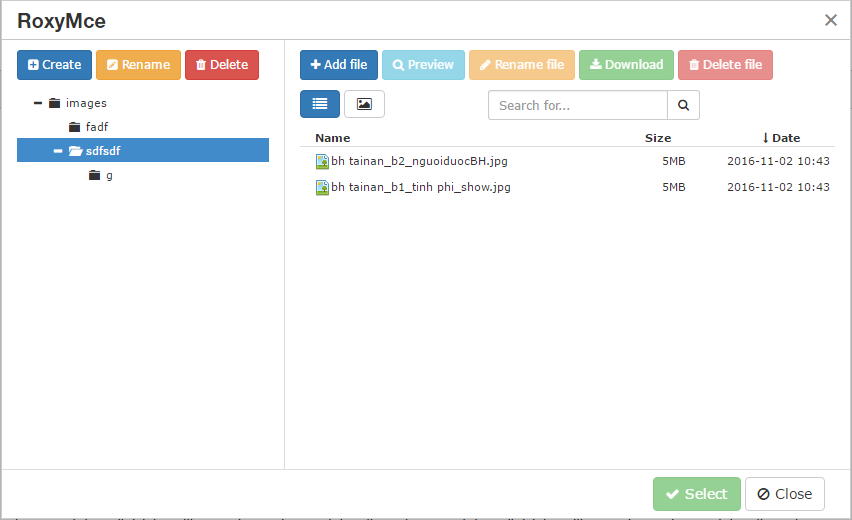

# RoxyMce - Beautiful File manager for Tinymce
This allow to integrate [TinyMce](https://github.com/tinymce/tinymce) 4 with Roxy File Manager

Install
---
Preferred way to install this extension through [composer](http://getcomposer.org)  
Either run
~~~
composer require navatech/yii2-roxymce "^2.0"
~~~
Or add to `require` section of `composer.json` then run `composer update`
~~~
"navatech/yii2-roxymce" : "^2.0" 
~~~

Configure & Usage
---
*  [Config module](docs/module.md)
*  [Widget usage](docs/widget.md)
*  [Without TinyMce](docs/without.md)

Screenshot
---

Resource
---

 * [TinyMce](http://tinymce.com)
 * [Project root](https://github.com/navatech/yii2-roxymce)

Bugs & Issues
---
Found some bugs? Just [create an issue](https://github.com/navatech/yii2-roxymce/issues/new) or [fork it](https://github.com/navatech/yii2-roxymce) and send pull request
